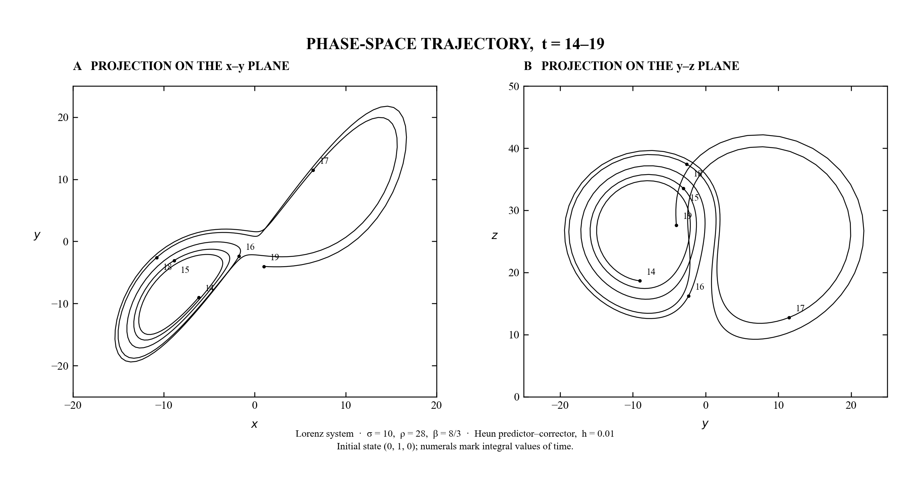

# Lorenz (1963), Figure 2

A small, tested reproduction of the two phase-space projections in Edward Lorenz's *Deterministic Nonperiodic Flow* (1963).



## Numerical specification

- Equations: `dx/dt = σ(y − x)`, `dy/dt = x(ρ − z) − y`, `dz/dt = xy − βz`
- Parameters: `(σ, ρ, β) = (10, 28, 8/3)`
- Initial state: `(x, y, z) = (0, 1, 0)`
- Integrator: second-order explicit trapezoidal predictor–corrector (Heun)
- Fixed step: `h = 0.01`
- Calculation: `t = 0…19`, exactly 1,900 steps
- Plotted segment: `t = 14…19`, 501 states

The numerals 14 through 19 on each projection mark integral values of time, as in the historical figure.

## Run with `uv`

From this directory:

```bash
uv sync
uv run pytest
uv run lorenz-figure
uv run lorenz-table
```

The figure command writes `figures/lorenz_figure_2.png` by default. The format follows the output extension, so a vector version can be generated with:

```bash
uv run lorenz-figure --output figures/lorenz_figure_2.svg
```

Without `uv`, an existing environment with NumPy, Matplotlib, and pytest can run:

```bash
python -m pytest
PYTHONPATH=src python -m lorenz1963.figure
```

## Verification

The tests check that:

1. the origin and `(±√72, ±√72, 27)` are equilibria, with matching signs;
2. `f(Su) = Sf(u)` for `S(x, y, z) = (−x, −y, z)`;
3. the invariant z-axis follows the exact solution `z(t) = z₀ exp(−βt)`;
4. halving the timestep reduces short-time global error by approximately four, as expected for a second-order method;
5. early values agree with Table 1 to its displayed three-decimal precision; and
6. the historical run contains exactly 1,900 fixed steps.

## Reproduction versus accurate long-time solution

This project deliberately reproduces the stated historical numerical procedure. It does **not** claim that Heun with `h = 0.01` shadows the exact trajectory indefinitely. The Lorenz system is chaotic: truncation, rounding, compiler, and solver differences are amplified until two valid calculations occupy different locations on the attractor. Agreement at short times and structural tests are therefore more informative than demanding pointwise long-time agreement from a modern high-accuracy solver.

No energy-conservation test is included because the Lorenz system is forced and dissipative.

## Reference

Lorenz, E. N. (1963). “Deterministic Nonperiodic Flow.” *Journal of the Atmospheric Sciences*, **20**(2), 130–141. <https://doi.org/10.1175/1520-0469(1963)020%3C0130:DNF%3E2.0.CO;2>
